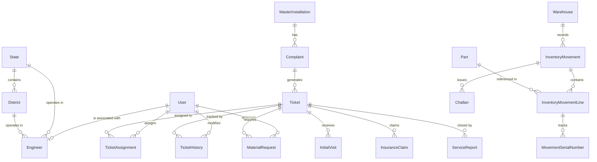

# Claro O&M Platform - Backend Database Schema

The database for the Claro O&M Platform is a managed **PostgreSQL** instance deployed via **Supabase**. The backend manages database operations, schemas, migrations, and relationship integrity using the **Prisma ORM**.

---

## 🛠️ Schema Models Overview

The database contains 24 models organized into distinct functional categories:

---

## 🔑 1. User & Access Control

### User
Tracks system user credentials, status, and system role.
* `id` (UUID, PK)
* `email` (String, Unique)
* `passwordHash` (String)
* `fullName` (String)
* `roleId` (String, FK to Role)
* `isActive` (Boolean, default: true)
* `createdAt` / `updatedAt` / `deletedAt` (Timestamps)

### Role
Defines target user roles (e.g., Admin, Field Engineer, Warehouse Manager).
* `id` (UUID, PK)
* `name` (String, Unique)
* `description` (String)

### Permission & RolePermission
Handles granular access control policies.
* `Permission`: `id` (UUID), `name` (String, Unique)
* `RolePermission`: Mapping table between `RoleId` and `PermissionId`.

---

## 📍 2. Geographical Hierarchy

### State
Represents states of operation (e.g., Maharashtra, Haryana).
* `id` (UUID, PK)
* `name` (String, Unique)

### District
Represents districts within a state.
* `id` (UUID, PK)
* `stateId` (String, FK to State)
* `name` (String)
* *Constraint*: Unique combination of `stateId` and `name`.

---

## 📋 3. Operations & Field Teams

### Engineer
Stores details of the field service engineers.
* `id` (UUID, PK)
* `userId` (String, FK to User, Optional)
* `name` (String)
* `email` (String, Unique)
* `phone` (String)
* `stateId` (String, FK to State)
* `districtId` (String, FK to District)
* `isActive` (Boolean, default: true)

---

## 🎫 4. Installations & Ticket Workflow

### MasterInstallation
Stores data for installed solar water pumps, linked to their government application IDs.
* `id` (UUID, PK)
* `applicationId` (String, Unique)
* `clientName` (String)
* `installationDate` (DateTime, Optional)
* `address` (String, Optional)
* `stateId` / `districtId` (Geographical FKs)

### Complaint
Synces the raw complaints/reports raised by beneficiaries.
* `id` (UUID, PK)
* `applicationId` (String, FK to MasterInstallation)
* `complainantName` (String)
* `complainantPhone` (String)
* `complaintType` (String)
* `description` (String, Optional)
* `submissionTimestamp` (DateTime)
* `syncStatus` (String, default: "PENDING")
* `project` (String, default: "Other")
* `metadata` (Json, raw payload from Google Sheet row)

### Ticket
Represents operational tickets generated to resolve complaints.
* `id` (UUID, PK)
* `ticketNumber` (String, Unique - deterministic sync number)
* `complaintId` (String, FK to Complaint)
* `status` (String, default: "RECEIVED")
* `priority` (String, default: "STANDARD")
* `dueDate` (DateTime, Optional)
* `metadata` (Json)

### TicketAssignment
Maps tickets to designated field engineers.
* `id` (UUID, PK)
* `ticketId` (String, FK to Ticket)
* `engineerId` (String, FK to Engineer)
* `assignedBy` (String, FK to User)
* `assignedAt` / `acceptedAt` / `rejectedAt` (DateTime logs)

### TicketHistory
Audit log recording every status change of a ticket.
* `id` (UUID, PK)
* `ticketId` (String, FK to Ticket)
* `changedBy` (String, FK to User)
* `oldStatus` (String, Optional)
* `newStatus` (String)
* `changeSummary` (String)

### InitialVisit
Tracks field visit diagnostics performed by engineers.
* `id` (UUID, PK)
* `ticketId` (String, FK to Ticket)
* `engineerId` (String, FK to Engineer)
* `visitDate` (DateTime)
* `remarks` (String, Optional)

### MaterialRequest & MaterialRequestItem
Tracks parts requested by field engineers to resolve hardware failures.
* `MaterialRequest`: `id` (UUID), `ticketId` (String), `requestedBy` (Engineer ID), `approvedBy` (User ID), `status` (String, default: "PENDING").
* `MaterialRequestItem`: Line items detailing part `itemName` and `quantity`.

### InsuranceClaim
Tracks commercial/insurance submissions for parts or installations.
* `id` (UUID, PK)
* `ticketId` (String, FK to Ticket)
* `claimNumber` (String, Unique)
* `providerName` (String)
* `amountEstimated` (Decimal)
* `status` (String, default: "SUBMITTED")

### ServiceReport
Final report submitted by engineers detailing parts repaired/restored to close a ticket.
* `id` (UUID, PK)
* `ticketId` (String, FK to Ticket)
* `reportDate` (DateTime)
* `workDone` (String)
* `tatMinutes` (Int, Optional)
* `status` (String)

---

## 📦 5. Inventory & Warehouse Logistics

### Manufacturer
List of manufacturers supplying replacement equipment.
* `id` (UUID, PK)
* `name` (String, Unique)

### Part
Catalog of available equipment parts (controllers, motors, pumps, cables).
* `id` (UUID, PK)
* `code` (String, Unique)
* `description` (String)
* `valuationAmount` (Decimal, default: 0.0)
* `serialTracked` (Boolean, default: true)

### Warehouse
Tracks active inventory depots (e.g., Jalgaon central warehouse).
* `id` (UUID, PK)
* `name` (String, Unique)
* `code` (String, default: "JAL")

### UnitLedger
Unified traceability register showing the current location and condition of every single serialized component.
* `serialNo` (String, PK)
* `partCode` (String)
* `status` (String - e.g., "Fresh", "Sent-to-Farmer", "Faulty-Received", "At-Manufacturer")
* `condition` (String, Optional - e.g., "New", "Repaired", "Scrapped")
* `currentLocation` (String - Warehouse ID, Farmer ID, or Manufacturer name)

### InventoryMovement, Line & Serial Numbers
Tracks item dispatches and receipts (movements between stages 1 to 5).
* `InventoryMovement`: `id` (UUID), `warehouseId` (FK), `type` (Int - movement stage), `partyName` (String), `referenceNumber` (String), `userId` (FK).
* `InventoryMovementLine`: Mapped line items containing `partId` and `quantity`.
* `MovementSerialNumber`: The individual serial numbers dispatched in the movement line.

### Challan
Official shipping manifest document mapping to a dispatch movement.
* `id` (UUID, PK)
* `challanNumber` (String, Unique)
* `movementId` (String, FK to InventoryMovement)
* `destinationName` (String)
* `destinationAddress` (String)
* `dispatchMode` (String)
* `totalAmount` / `gstRate` (Financials)

---

## 📝 6. Logs & Attachments

### Attachment
* `id` (UUID)
* `entityType` (String)
* `entityId` (String)
* `fileName` (String)
* `fileUrl` (String)

### Notification
* `id` (UUID)
* `userId` (String, FK to User)
* `title` / `message` (String)
* `isRead` (Boolean)

### AuditLog
* `id` (UUID)
* `userId` (String)
* `action` (String)
* `tableName` (String)
* `recordId` (String)
* `oldValues` / `newValues` (String)

### SyncLog
* `id` (UUID)
* `sheetName` (String)
* `rowNumber` (Int)
* `status` (String)
* `errorMessage` (String, Optional)
