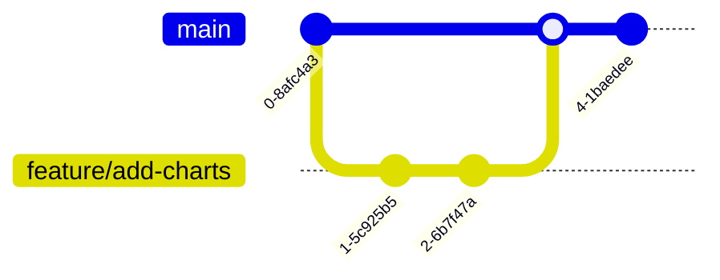

# Claro O&M Platform - Team Collaboration & Git Workflow Guide

This guide outlines how your team can collaborate on different branches, develop locally, test changes using preview environments, and deploy safely to production.

---

## 1. Branching Strategy

To keep the live website (`https://claro-om-platform.vercel.app`) stable, use the **Feature Branching** workflow:



*   **`main` Branch (Production):** 
    *   This is the protected, stable production branch.
    *   **Render** and **Vercel** are linked to this branch. Any merge or push to `main` instantly deploys changes to the live site.
*   **`feature/name` Branches (Development):** 
    *   Every developer creates a separate branch for their task (e.g., `feature/warehouse-kpi`, `bugfix/sheet-webhook`).
    *   Developers work on their branches, push code, and open a Pull Request (PR) to merge into `main`.

---

## 2. Step-by-Step Developer Workflow

When a team member starts a new task, they should follow these steps:

### Step A: Pull Latest Changes
Make sure your local repository is up to date with the live code:
```bash
git checkout main
git pull origin main
```

### Step B: Create a Feature Branch
Create and switch to a descriptive branch name:
```bash
git checkout -b feature/add-warehouse-filters
```

### Step C: Spin up Local Docker Environment
Start the local developer environment (PostgreSQL, Backend API, Frontend React):
```bash
docker compose up --build
```
*   The API will run at `http://localhost:3000`
*   The Web App will run at `http://localhost` (Port 80)
*   *Note: Any edits you make in your IDE will automatically hot-reload in Docker!*

### Step D: Implement and Verify Code
Before pushing, ensure both services compile cleanly with zero errors:
1.  **Backend Check:** Run `npm.cmd run build` inside `/backend` (checks TypeScript types).
2.  **Frontend Check:** Run `npm.cmd run build` inside `/frontend` (checks Vite bundle).

### Step E: Push to GitHub & Create Pull Request
1.  Stage, commit, and push your branch:
    ```bash
    git add .
    git commit -m "feat: add filters to warehouse operator page"
    git push origin feature/add-warehouse-filters
    ```
2.  Go to your GitHub repository and click **`Compare & pull request`**.
3.  Assign team members to review your code.

---

## 3. Preview Deployments on Vercel & Render

One of the best features of Vercel and Render is **automated staging environments**:

### A. Vercel Frontend Previews (Automatic)
*   When a developer opens a Pull Request on GitHub, Vercel automatically builds a **unique preview website** just for that branch (e.g. `https://claro-om-platform-git-feature-xxx.vercel.app`).
*   You can open this preview link in your browser to inspect and test your team member's UI changes *before* merging their code to the live production website!

### B. Render PR Previews (Optional)
*   You can configure Render to spin up a temporary "PR Review Instance" of your backend Express API when a PR is opened, which will destroy itself once the PR is merged or closed. (Settings can be enabled in the Render Dashboard ➡️ Pull Request Previews).

---

## 4. How to Handle Database Schema Changes (Prisma)

If a task requires adding a new table or field to the database (in [schema.prisma](file:///c:/claro/backend/prisma/schema.prisma)):

1.  The developer edits `schema.prisma`.
2.  They apply the migration locally to their local Docker PostgreSQL container:
    ```bash
    npx prisma db push
    ```
3.  When they commit and merge into `main`, Render will automatically execute `npx prisma db push` on the production Supabase database to apply the new schema fields without losing any data!
