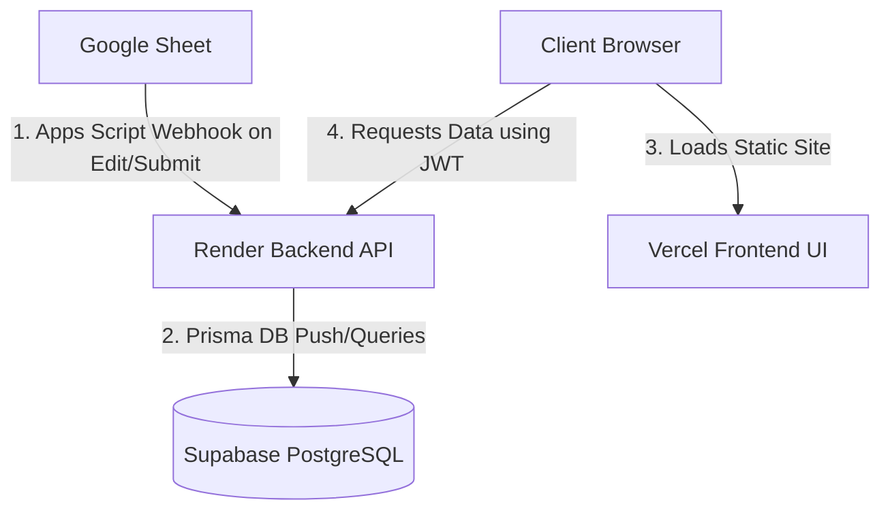

# Claro O&M Platform - Production Architecture & Operations Manual

This document provides a comprehensive overview of how the Claro O&M Platform V2 is deployed, how the services connect, and how to maintain and update the system (including shifting spreadsheets, modifying triggers, and keeping sheet access private).

---

## 1. System Architecture Overview

The system is a fully decoupled full-stack application. It consists of four main components interacting in real time:



*   **Google Sheet:** Serves as the primary operational data entry registry.
*   **Render Backend:** Hosts the Node.js/Express API. It handles webhooks from Google Sheets, generates tickets, manages assignments, and serves data.
*   **Supabase Database:** Hosts the PostgreSQL database containing all schemas and synced tables.
*   **Vercel Frontend:** Hosts the compiled React/Vite dashboard client.

---

## 2. Supabase (The Database)

The platform uses a managed **PostgreSQL** instance on Supabase.

### A. Connection String Configuration
Prisma connects to Supabase using two environment variables (configured on the Render backend):
*   **`DATABASE_URL`**: A connection pooling URL (usually port `6543` with `?pgbouncer=true`). This is used for standard runtime queries so the backend doesn't exhaust PostgreSQL's connection limits.
*   **`DIRECT_URL`**: A direct connection URL (usually port `5432`). This bypasses the pooler and is used exclusively by Prisma during build stages to execute migrations and schema pushes.

### B. Schema Modifications
If you modify [schema.prisma](file:///c:/claro/backend/prisma/schema.prisma) in the future:
1.  Apply the schema changes to your local SQLite database first to test:
    ```bash
    npx prisma db push
    ```
2.  Commit and push the changes to GitHub.
3.  On Render, the build process runs `npx prisma db push` automatically, which updates the Supabase schema in place without erasing data.

---

## 3. Render (The Backend API)

The backend Express app is deployed at `https://claro-om-platform.onrender.com`.

### A. Build and Start Settings
*   **Root Directory:** `backend`
*   **Build Command:** `npm install && npm run build`
*   **Start Command:** `npx prisma db push && npm start`
*   **Environment Variables:**
    *   `DATABASE_URL`: Connection pool URL to Supabase.
    *   `DIRECT_URL`: Direct database connection URL to Supabase.
    *   `JWT_SECRET`: Secret key used to sign dashboard login tokens.
    *   `INTEGRATION_SECRET`: Must be set to `claro_integration_secret_token_12345` (verifies Apps Script requests).
    *   `GOOGLE_SPREADSHEET_ID`: The ID of your active Google Sheet.

### B. Manual Redeployment
To deploy code changes, open your **Render Dashboard**, select `claro-backend`, click **`Manual Deploy`**, and select **`Deploy latest commit`**.

---

## 4. Vercel (The Frontend UI)

The React client dashboard is deployed at `https://claro-om-platform.vercel.app`.

### A. Build and Routing Settings
*   **Root Directory:** `frontend`
*   **Framework Preset:** `Vite`
*   **Build Command:** `npm run build`
*   **Output Directory:** `dist`
*   **Environment Variables:**
    *   `VITE_API_URL`: Set to `https://claro-om-platform.onrender.com/api/v1` (tells the client where to send API requests).

### B. Routing Rewrites (`vercel.json`)
Since this is a Single Page Application (SPA) utilizing React Router, deep page refreshes (e.g. going to `/amc` or `/tickets` directly) would return 404 errors on Vercel. 
To prevent this, the file [vercel.json](file:///c:/claro/frontend/vercel.json) specifies a rewrite rule directing all traffic back to `index.html`:
```json
{
  "rewrites": [
    { "source": "/(.*)", "destination": "/index.html" }
  ]
}
```

---

## 5. Google Sheets Integration & Privacy Management

When shifting to a new sheet or setting access to private, follow this guide.

### Step 1: Link a New Spreadsheet
1.  Copy the new **Spreadsheet ID** from your browser URL:
    `https://docs.google.com/spreadsheets/d/`**`[YOUR_NEW_SPREADSHEET_ID]`**`/edit`
2.  Go to the **Render Dashboard ➡️ Environment** tab, and update the **`GOOGLE_SPREADSHEET_ID`** variable. Save changes.

### Step 2: Configure Apps Script Triggers (Private/Restricted Sheet Sync)
To keep the spreadsheet **100% private** (shared only with you and selected editors), we use a **Direct Payload Push** method. When you click sync, the script reads and packages the rows locally using *your* access rights and pushes them directly to the backend.

1.  In your Google Sheet, open **`Extensions` ➡️ `Apps Script`**.
2.  Delete any code inside and paste the contents of [google_apps_scripts.js](file:///c:/claro/google_apps_scripts.js).
3.  Verify the `CONFIG` block at the top points to your live Render API:
    ```javascript
    var CONFIG = {
      API_BASE_URL: "https://claro-om-platform.onrender.com/api/v1", 
      API_SECRET_TOKEN: "claro_integration_secret_token_12345" 
    };
    ```
4.  Click **Save**.
5.  Go to the **Triggers** tab (clock icon on the left panel).
6.  Click **`+ Add Trigger`** and create the following trigger setups to capture both form submissions and manual cell edits dynamically:
    *   **Manual Cell Edit Sync:** Run `syncRowOnEdit` ➡️ From spreadsheet ➡️ **On edit**.
    *   **Complaint Sync:** Run `syncComplaintForm` ➡️ From spreadsheet ➡️ On form submit.
    *   **Initial Visit Sync:** Run `syncInitialVisit` ➡️ From spreadsheet ➡️ On form submit.
    *   **Material Request Sync:** Run `syncMaterialRequest` ➡️ From spreadsheet ➡️ On form submit.
    *   **Insurance Claim Sync:** Run `syncInsuranceClaim` ➡️ From spreadsheet ➡️ On form submit.
    *   **Service Report Sync:** Run `syncServiceReport` ➡️ From spreadsheet ➡️ On form submit.
7.  Click **Save** and accept the Google Permission prompt.

### Step 3: Set Permissions to Restricted
Once the Apps Script is saved and the triggers are enabled:
1.  Click **`Share`** on the top-right of your Google Sheet.
2.  Change **General Access** back to **`Restricted`**.
3.  Add only the specific emails of the contributors who need edit/view access to the sheet.

*Because the Apps Script runs inside the browsers of authorized contributors, it has access to read the sheet. It will push data directly to Render. The backend never has to download the spreadsheet directly, so the sheet can remain private!*